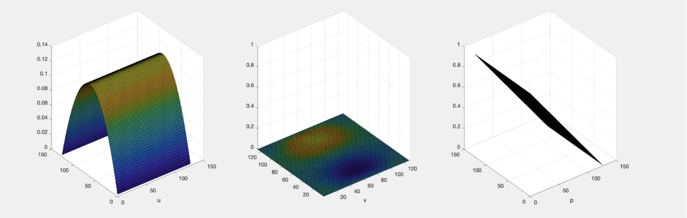
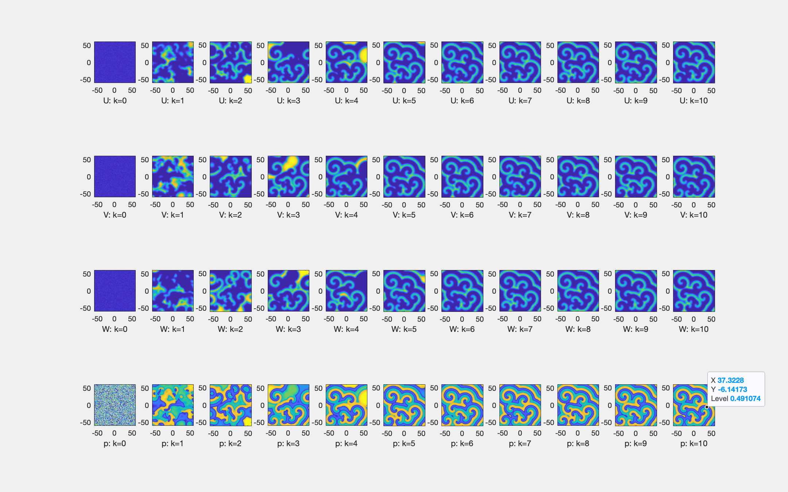
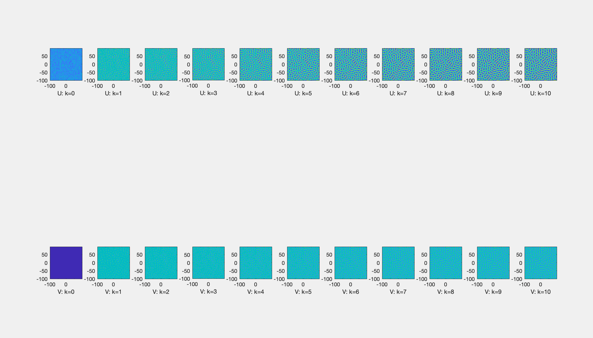

# High Performance Scientific Computing  
*David Chopp — Spring 2025*

---

## Project 1 — Stokes Flow Solver (C)

This solver computes steady-state velocity and pressure fields for **Stokes flow** in a 2-D channel using the **Successive Over-Relaxation (SOR)** method.

Uses:
- In-place updates
- Loop unrolling
- Scaling analysis over different grid sizes `N`

A second implementation, stokesparallel.c, uses OpenMP to parallelize the solver across multiple CPU threads, taking advantage of shared-memory architectures for additional speedup on multi-core machines.

**Runtime parameters** (passed via command line):  
`N`, `μ`, `P`, `ω`, `tol`, `K`

Results (e.g., for `./stokes 128 1 1 0.4 1e-9 100000`):

---

## Project 2 — Rock–Paper–Scissors Reaction–Diffusion (MPI + LAPACK)

This simulation models spatial pattern formation in a predator-prey system by solving a system of **reaction–diffusion PDEs** on a 2-D grid.

The solver uses a parallel ADI scheme with MPI domain decomposition and LAPACK tridiagonal solvers, facilitating scalability on distributed clusters.

Uses:
- MPI all-to-all matrix transposes for implicit solves
- Batched 1-D tridiagonal solves via `dgttrf` / `dgttrs`
- In-place pointer swaps
- Runtime logged to evaluate parallel scalability

**Runtime parameters:**  
`N`, `α`, `M`, `seed (optional)`

---

## Project 3 — Gierer–Meinhardt GPU Solver (CUDA)

GPU-accelerated solver for the **Gierer–Meinhardt activator–inhibitor system**, using **spectral differentiation (FFT)** and **RK4 time-stepping** entirely on the device.

Uses:
- 2-D FFTs via cuFFT
- CUDA kernels for reaction updates and RK4 stages
- Minimal CPU-GPU transfer, keeping computation mostly on the GPU
- Performance tracked with high-resolution CUDA timers

**Runtime parameters:**  
`N`, `D_u`, `D_v`, `a`, `b`, `c`, `ε`, `K`, `seed (optional)`

